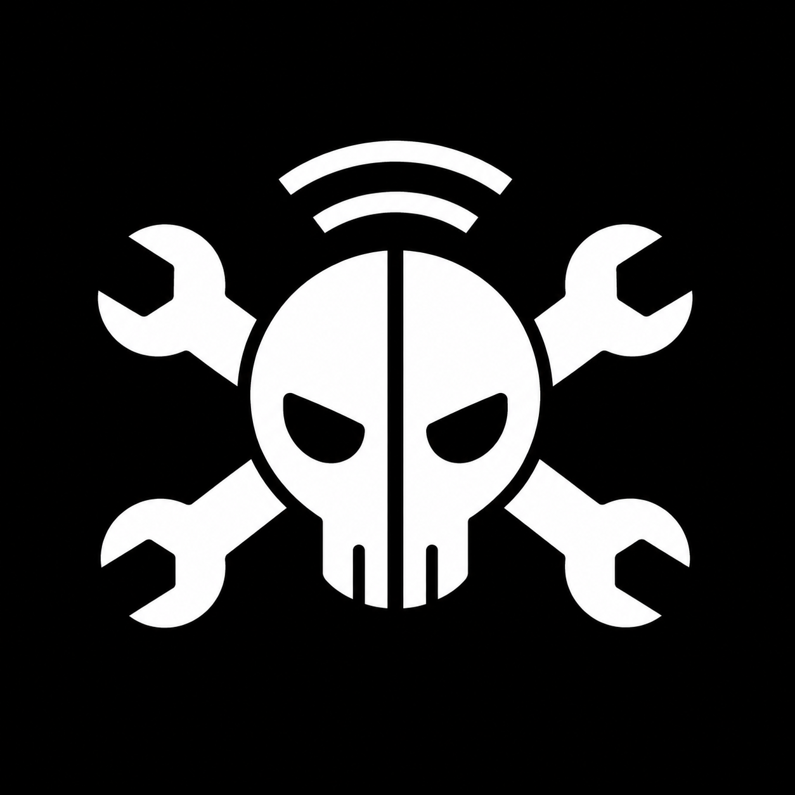

# ⚡ DELTA FIRMWARE

[](https://github.com/)
[](LICENSE)
[](https://www.espressif.com/)
[](https://github.com/olikraus/u8g2)
[](https://github.com/)

> **A powerful, multi-protocol tactical penetration testing, RF spectrum analysis, and IR cloning firmware built for the ESP32 platform.**

<p align="center">
  
</p>

---

## 📖 Overview

**Delta Firmware** transforms a standard ESP32 development board into a pocket-sized, self-contained multi-tool for security auditing, network reconnaissance, 2.4GHz RF spectrum monitoring, and infrared signal cloning. Designed with an ultra-responsive monochrome UI for 1.3" I2C OLED displays (SH1106 / SSD1306), Delta operates completely standalone using physical tactile directional buttons.

### 📸 Hardware Showcase

<p align="center">
  
  &nbsp;
  
</p>

<p align="center">
  <em>Left: Internal Hardware Assembly (Open Device) &nbsp;|&nbsp; Right: Completed Delta Device</em>
</p>

---

## ✨ Key Features

### 📡 Wi-Fi Security & Reconnaissance
* **Live Promiscuous Scanner:** Real-time 802.11 beacon and probe response frame analysis with live dynamic counters (`APs`, `STs`, and `PKTS` update continuously across channels 1–14).
* **OUI Vendor Identification:** Built-in MAC address lookup table identifying device manufacturers on the fly.
* **Recon Hunt Engine:** Autonomous surveillance engine that categorizes surrounding devices (Routers, Smartphones, Security Cameras, Printers) and assesses threat/risk scores.
* **Target Selection:** Detailed inspection of target APs (SSID, BSSID, Channel, Encryption: Open, WEP, WPA, WPA2, WPA3, RSSI).
* **Deauthentication Auditing:** Target single APs or associated stations for network resilience assessment.
* **Beacon Flooder:** Broadcasts realistic or custom SSIDs for Wi-Fi density and client behavior testing.
* **Evil Twin & Captive Portal:** Built-in web server with interactive portals to test credential handling and captive portal authentication.
* **Live Packet Monitor:** Real-time channel activity graph with frame rate metering and channel hopping.
* **Local LAN Port Scanner:** Audit open services on connected networks (HTTP, SSH, Telnet, DNS, HTTPS, RTSP, etc.).
* **Virtual Keyboard:** Full on-screen text input system for connecting to secured APs and saving signal profiles.

### 📻 2.4GHz RF Analysis (NRF24L01+)
* **RF Spectrum Analyzer:** Real-time 128-channel 2.4GHz spectrum analyzer displaying carrier energy distribution and noise floors.
* **RF Sweeper / Jammer Mode:** Diagnostic carrier jamming sweeps across the 2.4GHz ISM band for RF interference testing.

### 🔴 Infrared (IR) Cloner & Universal Remote
* **IR Signal Learning:** High-precision pulse capture via 38kHz IR receiver with waveform analysis and LittleFS storage.
* **Universal Remote Presets:** Built-in control library for major TV and Air Conditioner brands (Haier, Gree, Panasonic, Mitsubishi, Samsung, LG, TCL, Sony, Midea, Daikin, Nobel, Toshiba, Philips, Sharp, JVC, etc.).
* **Flooder Mode:** Rapid transmission of universal power-off codes across protocols.
* **Minimalist UI:** Clean, clutter-free transmission screen with one-click send and instant navigation.

### 💾 Storage & Upcoming Features
* **LittleFS Flash Storage:** Persistent storage for user-recorded IR signals, logs, and configurations.
* **🚀 MicroSD Card Module (Coming in Next Version):** Full SPI SD card support is currently being integrated into the firmware! The pinout architecture is already reserved (GPIO 16 CS on the shared SPI bus) and the next update will enable:
  * Raw 802.11 `.pcap` packet capture logging directly to SD card for Wireshark analysis.
  * Custom wordlists for captive portals.
  * Extended offline OUI vendor databases.
  * Backup and restore of recorded IR dumps.

---

## 🔌 Hardware Pinout & Wiring Guide

Delta Firmware is designed around standard, low-cost components wired to an ESP32 (30-pin or 38-pin DevKit):

| Component | Pin Function | ESP32 GPIO | Notes |
| :--- | :--- | :--- | :--- |
| **OLED Display** (SH1106 / SSD1306) | SDA | **GPIO 21** | I2C Data |
| | SCL | **GPIO 22** | I2C Clock |
| | VCC | **3.3V** | |
| | GND | **GND** | |
| **Navigation Buttons** | UP | **GPIO 26** | Active LOW (Internal Pull-Up) |
| | DOWN | **GPIO 14** | Active LOW (Internal Pull-Up) |
| | LEFT / BACK | **GPIO 32** | Active LOW (Internal Pull-Up) |
| | RIGHT | **GPIO 33** | Active LOW (Internal Pull-Up) |
| | SELECT / OK | **GPIO 13** | Active LOW (Internal Pull-Up) |
| **NRF24L01+ RF Module** | SCK | **GPIO 18** | Shared SPI Clock |
| | MISO | **GPIO 19** | Shared SPI MISO |
| | MOSI | **GPIO 23** | Shared SPI MOSI |
| | CSN | **GPIO 5** | Dedicated Chip Select |
| | CE | **GPIO 17** | Chip Enable |
| | VCC | **3.3V** | ⚠️ Add 10µF capacitor across VCC/GND! |
| | GND | **GND** | |
| **Infrared (IR)** | IR Receiver (TSOP/VS1838) | **GPIO 34** | Input-only GPIO (Safe for 38kHz RX) |
| | IR Transmitter (940nm LED) | **GPIO 25** | Drive via 2N2222 NPN transistor + 100Ω |
| **MicroSD Module** *(Next Release)* | CS | **GPIO 16** | Dedicated SD Chip Select |
| | SCK / MOSI / MISO | **18 / 23 / 19**| Shared Hardware SPI bus |

---

## 📐 Circuit Diagram

### Schematic Overview

```
                           +------------------------+
                           |      ESP32 DEVKIT      |
                           |                        |
                           |  [3.3V]  [GND]  [EN]   |
                           +----+-------+-----+-----+
                                |       |     |
      +-------------------------+       |     |
      |                                 |     |
      |   === I2C OLED (SH1106) ===     |     |
      +--> VCC                          |     |
      +--> GND -------------------------+     |
      |    SDA <----------------- GPIO 21     |
      |    SCL <----------------- GPIO 22     |
      |                                       |
      |   === 5-WAY BUTTONS (to GND) ===      |
      |    UP ------------------- GPIO 26     |
      |    DOWN ----------------- GPIO 14     |
      |    LEFT / BACK ---------- GPIO 32     |
      |    RIGHT ---------------- GPIO 33     |
      |    SELECT / OK ---------- GPIO 13     |
      |                                       |
      |   === NRF24L01+ (2.4GHz RF) ===       |
      +--> VCC (w/ 10uF cap)                  |
      +--> GND -------------------------+     |
      |    SCK  <---------------- GPIO 18     |
      |    MISO <---------------- GPIO 19     |
      |    MOSI <---------------- GPIO 23     |
      |    CSN  <---------------- GPIO 5      |
      |    CE   <---------------- GPIO 17     |
      |                                       |
      |   === INFRARED TRANSCEIVER ===        |
      +--> IR Receiver VCC                    |
      +--> IR Receiver GND -------------+     |
      |    IR Receiver OUT -----> GPIO 34     |
      |    IR TX LED (Driver) <-- GPIO 25     |
      |                                       |
      |   === MicroSD CARD (Next Ver) ===     |
      +--> SD VCC                             |
      +--> SD GND ----------------------+     |
      |    SD SCK <-------------- GPIO 18 (Shared SPI)
      |    SD MISO <------------- GPIO 19 (Shared SPI)
      |    SD MOSI <------------- GPIO 23 (Shared SPI)
      |    SD CS <--------------- GPIO 16 (Dedicated CS)
      |                                       |
      +---------------------------------------+
```

### Infrared Driver Circuit Note
To achieve maximum range with the IR emitter LED, wire an NPN transistor (e.g. 2N2222 or S8050) as follows:
* **ESP32 GPIO 25** ➔ 1kΩ Resistor ➔ Transistor **Base**
* **Transistor Emitter** ➔ **GND**
* **Transistor Collector** ➔ IR LED Cathode (-)
* **3.3V / 5V** ➔ 47Ω to 100Ω Resistor ➔ IR LED Anode (+)

---

## 🛠️ Software & Build Instructions

### Requirements
* [Arduino IDE](https://www.arduino.cc/en/software) (v2.0+) or [PlatformIO](https://platformio.org/)
* ESP32 Board Package (v2.0.x or v3.0+)

### Required Arduino Libraries
Install the following libraries through the Arduino Library Manager:
1. **U8g2** (by *oliver*) - For SH1106 / SSD1306 high-speed graphics.
2. **RF24** (by *TMRh20*) - For NRF24L01+ communication.
3. **ArduinoJson** (v7.x or v6.x by *Benoît Blanchon*) - For config & LittleFS signal parsing.
4. **IRremoteESP8266** (by *David Conroy et al.*) - If compiling raw IR support.

### Arduino IDE Configuration
* **Board:** `ESP32 Dev Module`
* **CPU Frequency:** `240MHz (WiFi/BT)`
* **Flash Frequency:** `80MHz`
* **Partition Scheme:** `Default 4MB with spiffs/littlefs (1.2MB APP / 1.5MB SPIFFS)` or `Minimal SPIFFS (1.9MB APP with OTA/190KB SPIFFS)`
* **Core Debug Level:** `None`
* **Port:** Select your ESP32 COM port

---

## 🎮 Navigation & Usage

* **[UP] / [DOWN]:** Scroll through menu items, lists, and options.
* **[SELECT] / [OK]:** Enter menu, confirm selection, toggle items, trigger transmit.
* **[LEFT]:** Go back to previous screen or stop running attacks / scans.
* **[RIGHT]:** Toggle item details / quick options.

---

## ⚠️ Disclaimer

Delta Firmware is developed strictly for **educational purposes, cybersecurity research, and authorized penetration testing**. Testing Wi-Fi networks, RF spectrums, or devices without explicit written permission from the owner is unlawful. The author (Abdullah Ali) assumes no liability for misuse or damage caused by this software.

---

## 📄 License

This firmware is licensed under the [License](LICENSE.md).

```text
License
Copyright (c) 2026 Abdullah Ali
```
